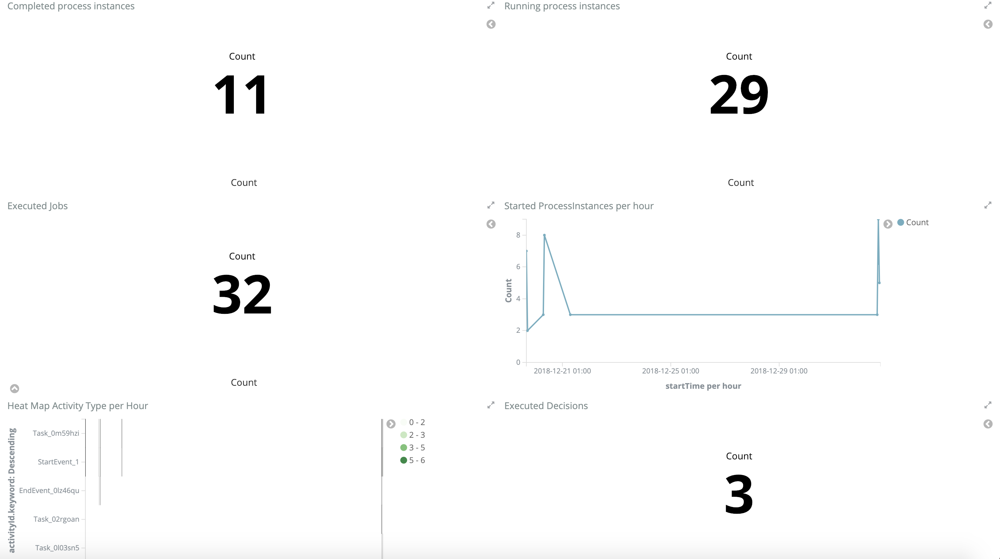
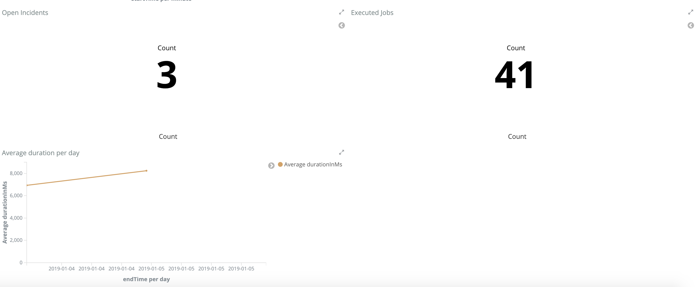

# Processevents

Integrates Camunda BPM historic process events with Elasticsearch via kafka

## How to use

1. Start Zookeper and Kafka under default ports
2. Start Elasticsearch (must be version 5.5 at the moment)
3. Start event-consumer (Spring Boot Application)
4. Start event-producer-sample-app (Spring Boot Application)
5. Go to localhost:8082. Login in with demo:demo and start a new process instance in tasklist
6. Produced events will be written to Apache Kafka topic and consumed by event-consumer which populates them to Elasticsearch under index 'camunda'

Example:

